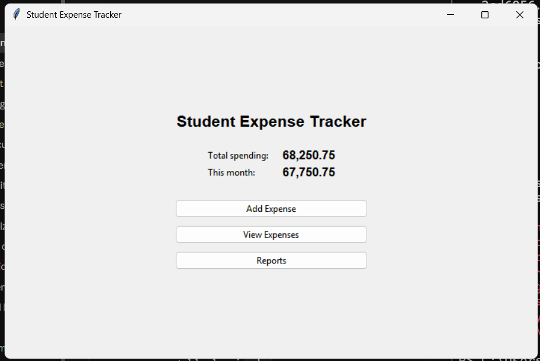
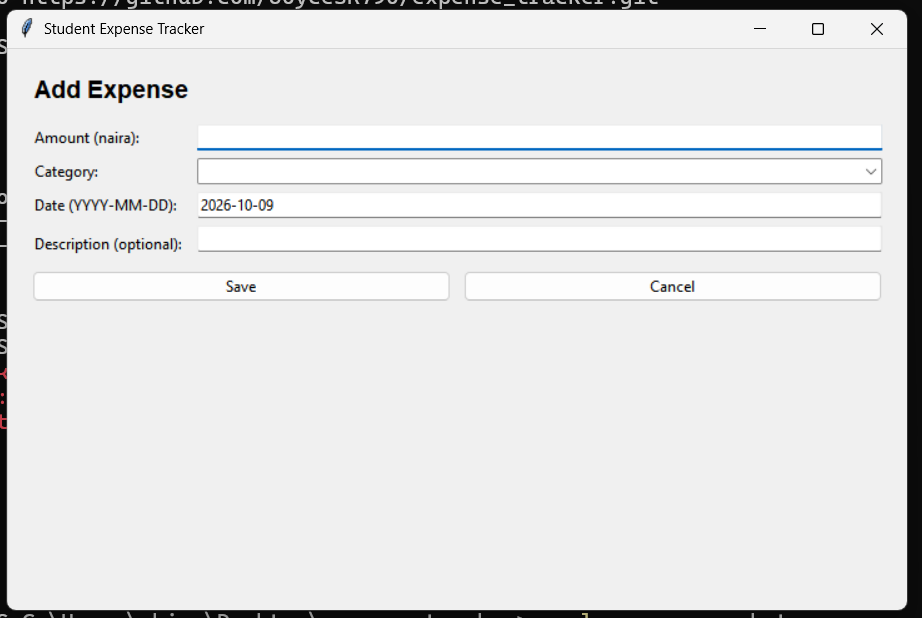
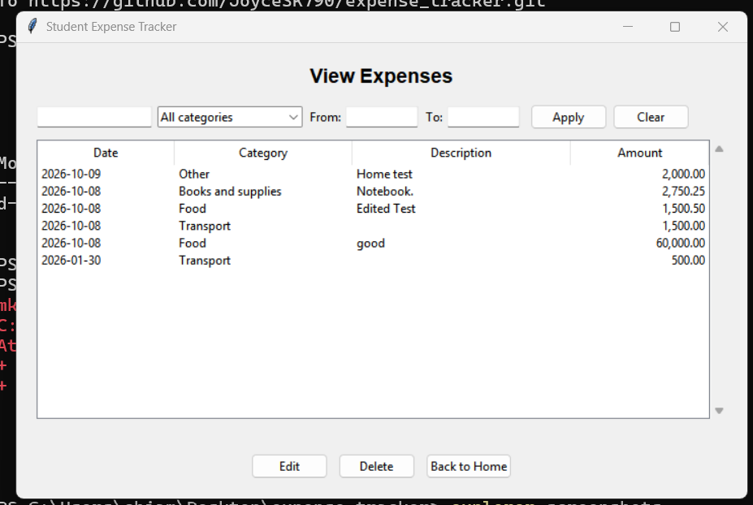
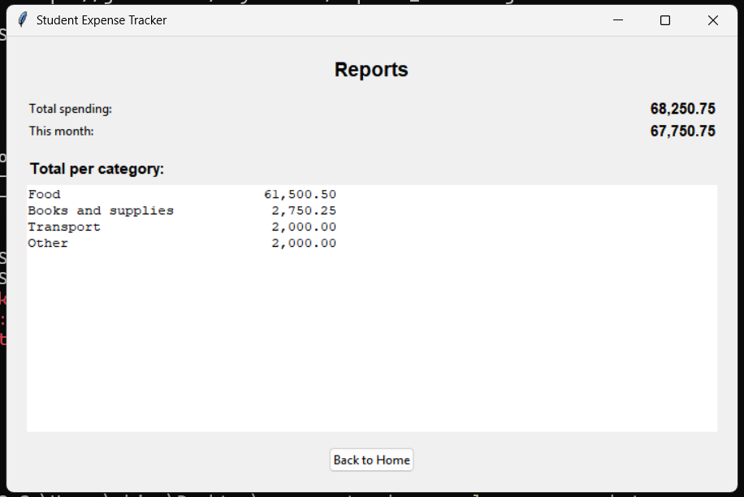

# Student Expense & Budget Tracker

The app is a single-user app used to record student expenses. It keeps a record of student expenses and was built to keep track of money being spent. It helps students understand how they spent their money and what it was spent on.

## Features

- Add, view, edit and delete expenses
- Search by description, filter by category and date range
- Home screen and Reports screen with total spending, this month's spending and a total per category
- Amounts stored as whole kobo, shown in naira with thousands separators
- Input validation with clear error messages

## Technologies

- Python 3.10 or newer
- Tkinter (ttk) for the interface
- SQLite (sqlite3) for storage
- pytest for automated tests
- Git and GitHub

## How to install and run

1. Install Python 3.10 or newer and Git.
2. Check that Tkinter and SQLite are available:

        python -c "import tkinter, sqlite3; print('OK')"

   On Linux, if tkinter is missing, install the python3-tk package.
3. Clone the repository and open the folder:

        git clone https://github.com/JoyceSK790/expense_tracker.git
        cd expense_tracker

4. Run the app:

        python main.py

The database file (expenses.db) is created automatically the first time you run the app.

## Screenshots

### Home

### Add Expense

### View Expenses

### Reports

## How I tested it

- 23 automated pytest tests for the database module, using a temporary database so real data is never touched:

        pip install pytest
        python -m pytest tests/ -v

- A manual checklist covering empty fields, bad amounts, add, edit, delete with confirmation, search and filter, report totals checked by hand, and closing and reopening the app. See MANUAL_TESTS.md.

## Project structure

- main.py: starts the app and switches between screens
- database.py: all SQLite code, with no Tkinter
- screens/: one file per screen, with no SQL
- tests/test_database.py: automated tests
- PROJECT_CONTEXT.md, PROMPT_LOG.md: how AI was used on this project

## Known limitations

- One user only, with no login or accounts
- The categories are fixed and users cannot add their own
- The table cannot be sorted by clicking column headings
- Dates are typed as text in YYYY-MM-DD format
- The Add Expense form is not centered in the window
- Tested manually on Windows only
